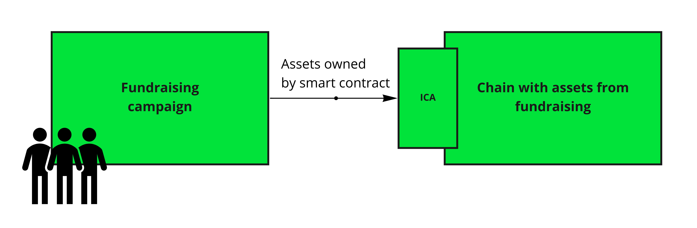
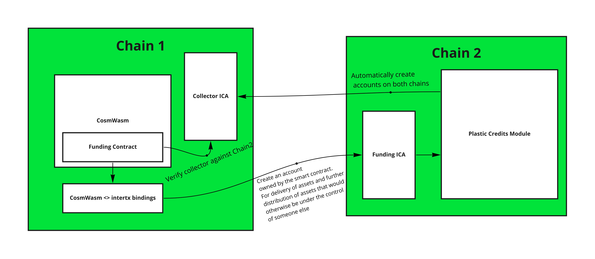

# Hackatom_2022

Our initial idea was to create work with eco credits on regen network using interchain accounts so that you could
create a presale funding mechanism for other chains over IBC and ICA.

We quickly realized that Regen was a bit too far behind on the IBC version and after a quick attempt to upgrade it we decided to create our own chain for this purpose.

To make the challenge a bit more interesting, we decided to use the DAO_UP contract as the basis, **meaning we would do Interchain Accounts over CosmWasm.**

## What you'll find in this repo

- A heavily modified version of DAO_UP CosmWasm to act as the basis for the fundraising contract
- A POC CosmWasm that can create interchain accounts and execute arbitrary messages on interchain account enabled chains 
- A brand-new POC blockchain with the following functionality
  - CosmWasm (configuration work)
  - Interchain accounts (configuration work)
  - Bindings for the intertx module (this allows CosmWasm contracts to create interchain accounts as well as make arbitrary interchain account transaction calls)
  -

## The project

The end idea had both technical and innovative elements:
- A cross-chain fundraising smart contract
- Using IBC and Interchain Accounts for the fundraising contract to be able to own assets on other chains (NFTs, pre-bought carbon/plastic credits, literally anything else that can be owned by an account)
  - The current capabilities of the smart contract is limited when it comes to utilizing assets on other chains
  - But one of the main ideas we had was also the ability for the smart contract to put assets they own on other chains up as leverage
    - This is not meant as a DeFi-only thing, but as a mechanism to put up both liquid and illiquid assets up as leverage for safe funding of legitimate projects

We are extremely bullish on Interoperability and see Interchain Accounts as the next big thing that will create
countless new use cases. Since this a passion of ours, we have thought of multiple other interesting things you could do with this:
- **A fundraiser for developers.** Community requires of developers, but most of the time employers don't trust on their capacities to face the challenges they'll have to deal with in a new job. This together with the idea that the lack of experience implies ineptitude makes really hard for them to get a better job. In a later phase of our project, the operator could be someone that trust in the abilities of a developer and help him backing them through this project, giving as collateral the equivalent of the salary he expects, encouraging the employers to hire him and give this subject the chance to show his skills with the goal of this new job. This essentially can be expanded to any job position, where the operator can support and give a collateral to the people that they trust their capacities to help them reach a better job.

# Other details

## Chain 1
Controller chain (Smart contract chain)
- chain-id: test-1
- home: data/test-1
- rpc: 0.0.0.0:16657
- Accounts:
  - Operator wasm18hl5c9xn5dze2g50uaw0l2mr02ew57zkq4ekwt (val1)
  - Collector wasm1m9l358xunhhwds0568za49mzhvuxx9uxf9974x (demowallet1)
  - Funder/Sponsor wasm1mjk79fjjgpplak5wq838w0yd982gzkyff27t5s (rly1)

## Chain 2
Host chain (Plastic credit chain)
- chain-id: test-2
- home: data/test-2
- rpc: 0.0.0.0:26657
- Accounts:
  - Credit Issuer/Operator wasm1qnk2n4nlkpw9xfqntladh74w6ujtulwn5wkh5w (val2)
  - Collector wasm10h9stc5v6ntgeygf5xf945njqq5h32r5mq3f99 (demowallet2)
